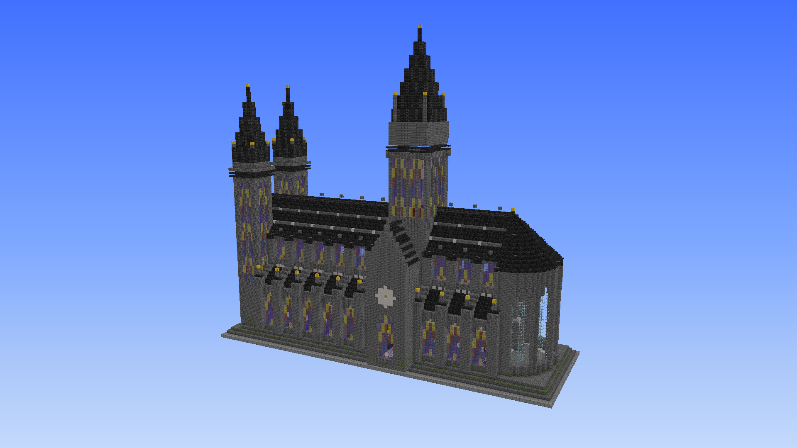

# BlockScript

> A structured Minecraft building DSL designed for language models, with spatial primitives, reusable components, validation, ASCII rendering, and schematic export.

BlockScript is a Python-based building DSL for generating Minecraft structures programmatically.

Instead of asking a language model to produce thousands of raw block placements, BlockScript gives it a structured spatial language: **frames, grids, components, stages, transforms, queries, validation, and textual rendering**.

The goal is simple:

**Let language models build Minecraft structures in a structured way.**


See chat example: [EXAMPLE](https://www.workbuddy.link/p/FIYOuk3cUr9JyL5TBIGS3y?ext2=copy_link) (By deepseek v4.1)



---

## ✨ Why BlockScript?

Generating a Minecraft structure directly as raw coordinates quickly becomes difficult for both humans and language models.

A simple building can already require thousands of operations:

```text
/setblock ...
/setblock ...
/fill ...
/setblock ...
...
```

BlockScript moves the abstraction level upward.

A model can instead reason about:

```python
w.stage("nave", build_nave)

w.define("pier", build_pier)

w.place(
    "pier",
    at=w.grid_at("bays", 3)
)

w.compare.symmetry(...)
```

The resulting structure remains voxel-based, but the **program used to construct it is structured and reusable**.

This makes BlockScript particularly suitable for LLM-generated architecture.

---

## 🧱 Core Concepts

### Spatial primitives

BlockScript provides common Minecraft building operations:

```python
w.set((0, 64, 0), "stone_bricks")

w.fill(
    box((0, 64, 0), (10, 70, 10)),
    "stone_bricks"
)

w.pillar((5, 64, 5), 8, "stone_bricks")
```

Higher-level primitives are also available:

```python
w.wall(...)
w.floor(...)
w.ceiling(...)
w.hollow_box(...)

w.cylinder(...)
w.dome(...)
w.sphere(...)

w.stairs_run(...)
w.arch(...)
w.roof_gable(...)
w.roof_pyramid(...)
w.hip_roof(...)
```

The library also provides geometric helpers such as `circle_xz()` and `disc_xz()`.

---

## 🧭 Frames

Coordinates don't have to be expressed entirely in world space.

A `Frame` provides a local coordinate system with its own orientation:

```python
f = Frame(w, at=(0, 64, 0), yaw=90)

f.fill(
    box((-3, 0, 0), (3, 5, 0)),
    "stone_bricks"
)
```

This makes it possible to define a structure once and reuse it in different orientations.

Inside a frame, directions such as:

```text
+u / -u
+v / -v
+w / -w
```

can be used instead of manually converting Minecraft's world directions.

---

## 🧩 Reusable Components

Repeated architectural elements can be defined as components.

```python
def build_pier(t):
    t.fill(
        box((-1, 0, -1), (1, 10, 1)),
        "stone_bricks"
    )

w.define("pier", build_pier)

w.place(
    "pier",
    at=(10, 64, 20)
)
```

Components can then be instantiated, replayed, patched, and transformed.

This is particularly useful for architecture:

```text
pier
window
column
arch
tower
buttress
roof section
```

Instead of generating every block independently, the model can describe the **structural vocabulary of the building**.

The cathedral example uses reusable `pier` and `flyer` components.

---

## 📐 Grids

Large structures can be organized around an architectural grid.

For example:

```python
w.grid(
    "bays",
    origin=(0, 64, 0),
    step=(0, 0, 8),
    count=6
)
```

Components can then be placed relative to the grid:

```python
w.place(
    "bay",
    at=w.grid_at("bays", 3)
)
```

This allows a language model to reason in terms of:

```text
bay 1
bay 2
bay 3
bay 4
```

rather than manually maintaining dozens of world coordinates.

---

## 🏗️ Staged Construction

Large structures can be divided into independent stages.

```python
w.stage("foundation", build_foundation)
w.stage("nave", build_nave)
w.stage("roof", build_roof)
```

Stages can be inspected, rerun, or reverted:

```python
w.stage_box("nave")

w.rerun("nave")

w.revert_to("nave")
```

This is especially useful for LLM workflows because a large building does not need to be regenerated as one enormous program.

Stages can also be saved and loaded between sessions.

---

## 🔍 Validation

BlockScript isn't only a structure generator.

It can inspect the resulting world and detect common construction problems.

```python
w.lint()
```

Validation includes issues such as:

* blocked doors
* invalid double-block structures
* unsupported/falling blocks
* connection inconsistencies
* enclosed spaces
* missing lighting

The result can be inspected before exporting the structure.

---

## 🪞 Symmetry Checking

Architectural symmetry can be explicitly verified.

```python
w.compare.symmetry(...)
```

This is useful for structures such as:

```text
cathedrals
castles
temples
bridges
towers
palaces
```

Instead of merely asking the model to *remember* symmetry, the generated structure can be checked afterward.

---

## 👁️ ASCII Rendering

One of BlockScript's most important features for language-model workflows is its **text-based renderer**.

Structures can be inspected without a Minecraft client or a traditional 3D viewer.

```python
w.render.slice(...)
w.render.section(...)
w.render.view(...)
w.render.overview(...)
w.render.iso(...)
```

For example, an LLM can generate a structure, render a section, inspect the textual result, and modify the construction program.

This creates a simple feedback loop:

```text
Generate
   ↓
Build voxel structure
   ↓
Render
   ↓
Inspect
   ↓
Patch
   ↓
Render again
```

The renderer is intentionally text-oriented: the output can be directly consumed by a language model rather than requiring a graphical vision system.

---

## 🔧 Patchable Structures

Individual instances can be modified without rebuilding the entire structure.

```python
inst = w.instance("pier", 2)

w.patch(
    inst,
    (0, 2, 0),
    "gold_block"
)
```

Changes can also be inspected through diffs and undone afterward.

This makes iterative construction practical:

```text
build
→ inspect
→ patch
→ diff
→ undo / keep
```

---

## 📊 Querying the World

The generated structure can be queried programmatically:

```python
w.query.count()

w.query.where("torch")

w.query.nearest(
    "front_door",
    "torch"
)

w.query.neighbors(
    (0, 64, 0)
)

w.query.histogram()
```

Other queries can inspect:

* block counts
* empty positions
* neighboring blocks
* ray intersections
* nearest blocks
* material histograms
* structural support
* bounds and volume

This gives the model another way to inspect the generated structure beyond rendering.

---

## 📦 Export

Once the structure is complete, it can be exported into Minecraft-compatible formats.

```python
w.export_schem("out/build.schem")
```

The project supports:

* `.schem`
* `.nbt`
* `.json`

The `.schem` exporter produces Sponge v3 schematic data suitable for tools such as WorldEdit and Litematica.

JSON output can also preserve the structure in a replayable representation.

---

## 🏰 Example

The repository includes a large Gothic cathedral example.

The example contains:

* twin west towers
* nave
* aisles
* transept
* crossing tower
* choir
* chevet
* Gothic arches
* flying buttresses
* stained glass
* multiple architectural materials

It combines:

```text
Grid
Components
Stages
Frames
Symmetry checking
ASCII rendering
Lint
Patching
Export
```

The example is intentionally built using the public BlockScript API rather than modifying the library itself.

---

## 🤖 Designed for Language Models

BlockScript is not intended to replace a 3D modeling application.

Its purpose is different.

A traditional 3D application provides a graphical environment for a human designer.

BlockScript provides a **structured textual environment for a language model**.

Instead of:

```text
LLM → thousands of raw block coordinates
```

BlockScript encourages:

```text
LLM
 ↓
architectural plan
 ↓
components / grids / frames
 ↓
voxel construction
 ↓
validation
 ↓
ASCII inspection
 ↓
patch / refine
 ↓
schematic
```

This gives the model a compact vocabulary for expressing spatial structure while keeping the final result completely voxel-based.

---

## 🧠 Design Philosophy

BlockScript follows a few core principles:

**Structure over coordinates**

Prefer:

```python
w.grid_at("bays", 4)
```

over manually calculating every world position.

**Local coordinates over global coordinates**

Use `Frame` to define reusable structures.

**Reusable components over repeated code**

Define an architectural element once and instantiate it many times.

**Stages over giant scripts**

Break large buildings into manageable construction phases.

**Validation over assumptions**

Check symmetry, block states, structure, and spatial constraints.

**Textual feedback over invisible generation**

Render the world into a representation that an LLM can inspect.

---

## 🚀 Quick Start

```python
from mcbuild import World, box

w = World()

w.fill(
    box((0, 64, 0), (10, 64, 10)),
    "stone_bricks"
)

w.pillar(
    (5, 65, 5),
    8,
    "stone_bricks"
)

w.render.overview()

w.export_schem("house.schem")
```

The core library is intentionally lightweight and has zero third-party runtime dependencies.

---

## 🗺️ Roadmap

Potential future directions include:

* richer architectural primitives
* improved spatial queries
* more powerful component composition
* better LLM-oriented error messages
* incremental build / repair workflows
* richer textual visualization
* additional schematic formats
* multimodal build feedback
* agent-based iterative construction

---

## 📄 License

MIT

---

## 💡 Concept

> **Minecraft is a voxel world.
> BlockScript is a language for describing how to build one.**

BlockScript is designed around a simple idea:

**Give language models spatial tools instead of asking them to memorize coordinates.**
